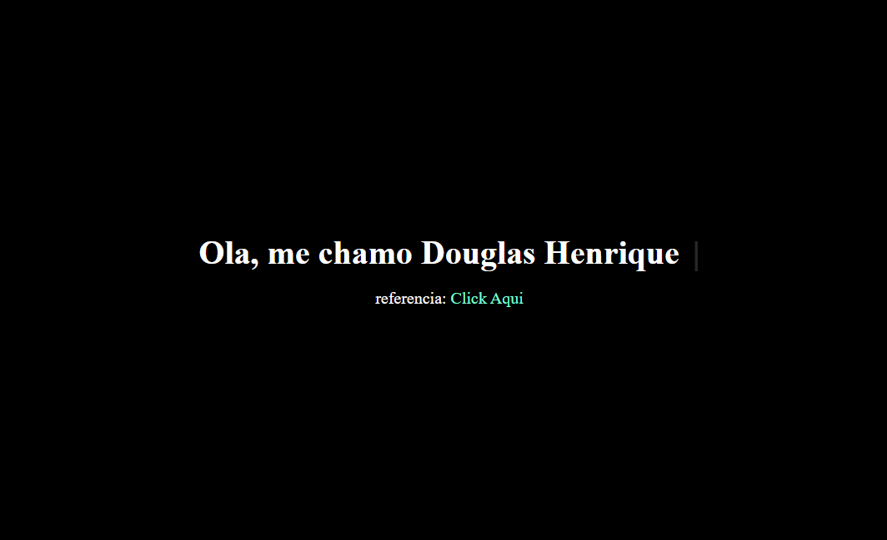

# Repositorio de Componentes

## 1. Aterar Tema
  Altera o tema com base no themeSystem.

  ### Modo Light
  

  ### Modo Dark
  

## 2. Efeito Escrevendo
  Cria o efeito de maquina ao abrir a tela de escrever no elemento de texto desejado.

  

  referencia: https://youtu.be/zx2axQoY_YM?si=x3poR0PFeSQHefXy

## 3. Formulario de Cadastro
  Tela de Cadastro com validação dos campos

  

## 4. Menu em Hexagono
  Menu construido usando a forma de hexagonos em seus botões

  

  referencia: https://youtu.be/ZG1eH2Bu-qI?si=XH0rW3Dbbx7PaNP3